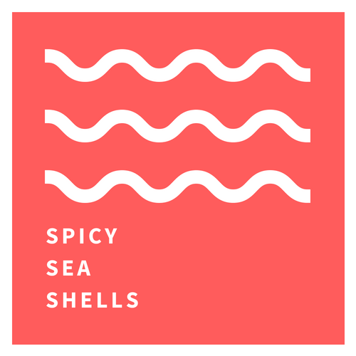

<p align="center">
    
</p>
<h1 align="center">
  Spicy Sea Shells Website
</h1>

Website for the Spicy Sea Shells crew. Built with Astro, deployed on Netlify.

[Setup](#setup) | [Commands](#commands) | [Content](#content) | [Meta](#meta) | [Maintenance](#maintenance)

## Setup

**Prerequisites:** Node.js v20+, npm

```sh
npm install
npm run dev     # http://localhost:4321
```

## Commands

| Command | Description |
|---|---|
| `npm run dev` | Start local dev server |
| `npm run build` | Type-check and build for production |
| `npm run preview` | Preview the production build locally |

## Content

### Updating a Profile

Edit `src/profiles.ts`. Fields:

* `id`: unique identifier, used as the image filename prefix (e.g. `sophie` → `sophie_tall.jpg`, `sophie_wide.jpg`)
* `name`: the name displayed on the site
* `city`: where you're based — format as `City, Country` or `City, State`
* `bio` and `bioShort`: a blurb about yourself — `bio` for desktop, `bioShort` for mobile. Recommended max: 180 and 160 characters respectively.
* `socialMedia`: an object with any platforms you want displayed (all optional, max 5). Supported keys: `dribbble`, `facebook`, `github`, `instagram`, `linkedin`, `medium`, `twitter`, `website`

Profile images go in `assets/profiles/` and must be named `{id}_tall.jpg` and `{id}_wide.jpg`. Required minimum dimensions:
* **tall**: 160px × 320px (1:2)
* **wide**: 288px × 180px (8:5)

### Adding Blog Posts

Posts live in `content/posts/` as `.md` files. Filename has no hard requirements but `YYYY-MM-DD-slug.md` is recommended.

Required frontmatter:

```yaml
title: "Post Title"
date: YYYY-MM-DD
slug: "url-slug"
author: "id-from-profiles"
```

Images and other assets go in `content/img/` and should be referenced as `../img/image_name.jpg`.

Optional frontmatter:

```yaml
crosspost:
  url: https://example.com/post
  site: "Site Name"
  hasPrefix: false   # true → "This is a crosspost from the X", false → "This is a crosspost from X"
```

## Meta

© The Spicy Sea Shells

The site is built using [Astro](https://astro.build/). It is hosted and deployed via [Netlify](https://netlify.com/). The font used is [Source Sans 3](https://fonts.google.com/specimen/Source+Sans+3).

## Maintenance

**Functionality:**

- [ ] Visit the site and click through all main pages - anything broken, missing, or visually off?
- [ ] Test on mobile - responsive layout can break silently after dependency updates
- [ ] Check for console errors in production (browser devtools)

**Dependencies & Security:**

- [ ] Run `npm outdated` - review available updates
- [ ] Run `npm audit` - address any security advisories
- [ ] Update non-breaking deps (patch/minor)
- [ ] Update breaking deps in a separate commit/deploy
- [ ] Run `npx fallow` for code quality

**Infrastructure:**

- [ ] Check Netlify dashboard - recent builds succeeding? Any errors or warnings?