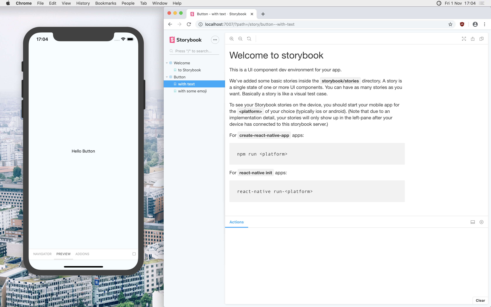
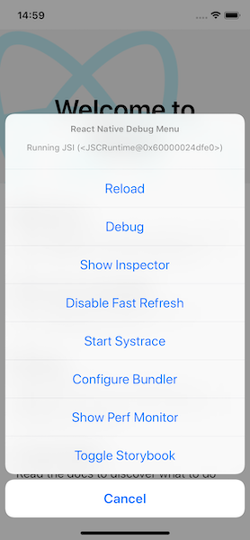

[Storybook](https://storybook.js.org/) is a tool for documenting a design system and developing modular apps. It is popular in the web development community and I've used it in all my bigger projects. So when I transitioned from web development to working on a React Native codebase, I set up Storybook too. Here's how I did it:

## Setting up the Storybook UI

### 1. Install Storybook using the initializer

If you install Storybook using the built in initializer, it will do most of the setup work for you. In the root directory of your project run

    npx -p @storybook/cli sb init

When you get asked if you want to install the storybook server, type `yes`. The server will show your story tree in a web UI but won't actually show you the rendered components. It's very handy for navigating the stories though when you amass enough of them.

If you use TypeScript, don't forget to install the types and convert all files:

    npm install @types/storybook__react --save-dev

If everything went well, your folder structure should look like this: (Assuming you use TypeScript)

```bash
storybook/:
./stories
./addons.ts
./index.tsx
./rn-addons.ts
```

### 2. Run the Storybook UI on your device

The export coming from `storybook/index.tsx` is a simple React component. This means you can render it like you would any other component. The simplest way to show the UI in your simulator is by mounting it instead of the actual app. That would mean changing the root `index.js` like so:

```javascript
import { AppRegistry } from "react-native";

import StorybookUIRoot from "./storybook";

AppRegistry.registerComponent("MyApp", () => StorybookUIRoot);
```

And adjusting the `storybook/index.tsx` like so:

```javascript
import { getStorybookUI, configure } from '@storybook/react-native';

import './rn-addons';

// import stories
configure(() => {
  require('./stories');
}, module);

const StorybookUIRoot = getStorybookUI({});

export default StorybookUIRoot;
```

If you want, you can control the simulator UI using the Storybook Web UI. To do this, you need to first run `npm run storybook`, When the server has finished launching, run the app as usual with `npm run ios/android`. Note that the actual design elements will never show in the browser UI, only on your device.



### 3. Run the Storybook UI side by side with the app on your device

Chances are, you would like to still be able to see the actual app and only show the Storybook UI on request. And only when you're running in dev mode. To do this, we can use the device dev menu. Install

    npm install react-native-dev-menu --save-dev

And then create a new file called `Root.tsx` with the following content:

```javascript
import React, { useCallback, useEffect, useState } from "react";

import Storybook from "../storybook";
import App from "./App";

const Root = () => {
  const [storybookActive, setStorybookActive] = useState(false);
  const toggleStorybook = useCallback(
    () => setStorybookActive(active => !active),
    []
  );

  useEffect(() => {
    if (__DEV__) {
      // eslint-disable-next-line @typescript-eslint/no-var-requires
      const DevMenu = require("react-native-dev-menu");
      DevMenu.addItem("Toggle Storybook", toggleStorybook);
    }
  }, [toggleStorybook]);

  return storybookActive ? <Storybook /> : <App />;
};

export default Root;
```

Here, we're creating a Storybook toggle in the dev menu but only when we're actually running the app in dev mode. On toggle, we're mounting either the Storybook UI or the 'regular' app.

Following that, we need to change the import in the `index.js` file:

```javascript
import { AppRegistry } from "react-native";

import { name as appName } from "./app.json";
import Root from "./src/Root";

AppRegistry.registerComponent(appName, () => Root);
```



## Writing Stories and using add-ons

### Registering an Add-On

One of the most useful add-ons in storybook is `knobs`. It allows you to use toggles and dropdowns (amongs other things) to change the props of the components you're rendering in your story. It will serve as an example on how to set up add-ons on React Native:

Install both the browser and the on-device version:

    npm install @storybook/addon-knobs @storybook/addon-ondevice-knobs --save-dev

Register the add-on in both the `addons.ts` and `rn-addons.ts` files.

`rn-addons.ts`:

```javascript
import "@storybook/addon-ondevice-knobs/register";
```

`addons.ts`

```javascript
import "@storybook/addon-knobs/register";
```

And then you're ready to go. To find out how to use `knobs` have a look at the examples in the [official README](https://github.com/storybookjs/storybook/tree/master/addons/knobs).

### Wrapping Storybook with Providers

Before you can render one of your components in storybook there is a bit of house keeping. Step number one is wrapping the Storybook base component in all the providers you need (e.g. i18n libraries). The providers can be mocked away but depending on how complex your provider is it might not be worth it. For our i18n library for example we're using the actual implementation. If you need to use redux or axios for example you will probably want to mock those out though.

`index.tsx`:

```javascript
import "./rn-addons";

import { configure, getStorybookUI } from "@storybook/react-native";
import React from "react";
import { I18nextProvider } from "react-i18next";

import i18n from "../src/i18n";

configure(() => {
  require("./stories");
}, module);

const StorybookComponent: React.FC = () => (
  <I18nextProvider i18n={i18n}>{getStorybookUI({})}</I18nextProvider>
);

export default StorybookComponent;
```

## Conclusion

Now you're all set up and ready to use Storybook with your React Native App. Be aware that Storybook can unfortunately be a bit fiddly and buggy sometimes. But if you work out the kinks it can be a great resource to your team.
